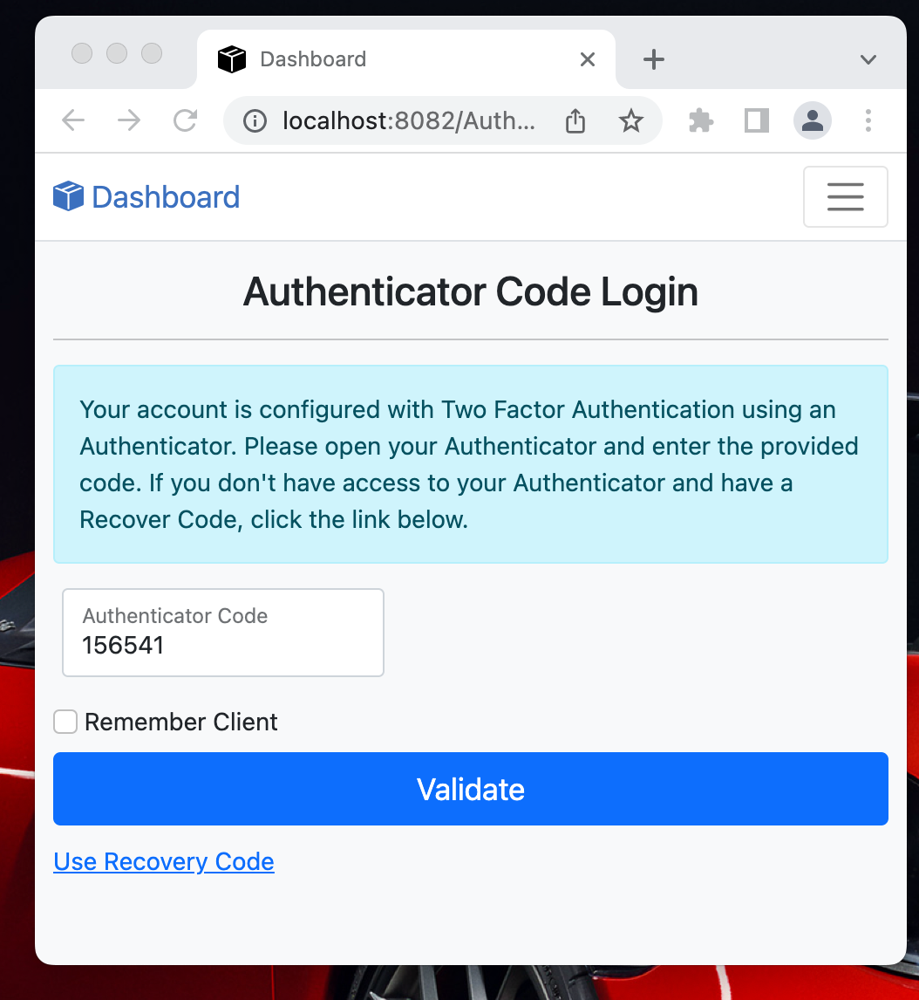
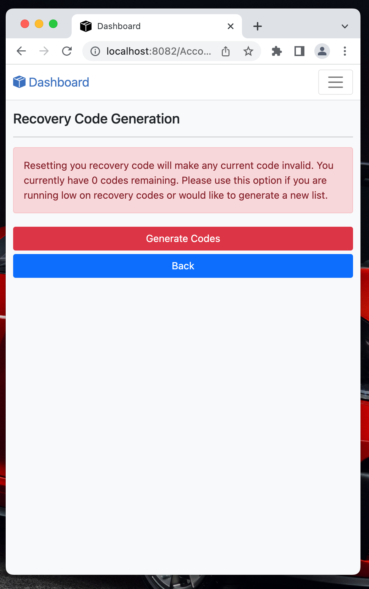

# NetFusion-Identity


### Running within Docker


Running the below command will complete the following:

Creates ***authclient*** image:

* Creates layer based on:  mcr.microsoft.com/dotnet/sdk
* Installs NodeJs - Used to run any NPM scripts
* Restores and Builds the NetFusion-Identity Solution
* Publishes the NetFusion-Identity Solution
* Creates layer based on: mcr.microsoft.com/dotnet/aspnet
* Copies published application to layer

Creates **sql-server-dev** image:

- Creates layer based on: mcr.microsoft.com/mssql/server
- Copies needed SQL scripts 
- When container is created, creates database with needed tables and data

``` bash
./deploy/docker/compose-up.sh
```

The following shows the containers created from running Docker-Compose:

			

Note:  Seq is also installed for displaying the logs written by the Web Authentication Client.

Enter the following URL into a browser:

``` text
http://localhost:8082/Authentication/Login
```

	

Enter the following URL to view the SEQ logs:

``` text
http://localhost:8041/
```


### Registering New User

Select ***Register as New User*** link to create a new account.


### Resend Email Confirmation

After creating a new account, the user is navigated to the Resend Email Confirmation page in case they have not received the confirmation email.


### Confirm Email Account

Since the application is not configured to send emails, the confirmation URL that would have been received within an email is written to the console.  If running within Docker, this log can be viewed by entering the following command:

``` bash
docker logs auth-web-client
```

Locate the confirmation URL within the log and copy it into the browser:


After entering the logged URL into the browser, enter the corresponding email address:


### Initial Login

After confirming the account, the user is navigated to the Login screen.


After entering the credentials, the user is navigated to the main Dashboard:


### Account Settings

Selecting the logged in user's email address on the toolbar, displays the account's settings:


### Two-Factor Configuration

Selecting the ***Two-Factor*** button will display the current Two-Factor settings:


### Configuring an Authenticator

Select the ***Add Authenticator*** button to navigate to the Authenticator screen:


Scan the above QR code using an Authenticator App:


Next, enter a code generated by the Authenticator App to validate:


After the Authenticator App is verified, the user is navigated back to the Two-Factor Configuration page:


To test that Two-Factor authentication was configured, logout of the dashboard.  Next, login with the user's credentials and you will be prompted to enter a code.  Enter a code generated by the Authenticator App and you will be navigated to the dashboard.



### Recovery Codes

The user can also generate a list of recover-codes used in the event they don't have access to their Authenticator App:



After selecting the ***Generate Codes*** button, the following will show.  These codes can be used only once to log into the application when Two-Factor authentication is enabled. 


### Claim Administration

If the user is assigned the ***Admin*** role within the ***Dashboard*** scope, they will have access to another page used to manage claims and roles associated with accounts.  Run the following script to add a user to the Admin role:


``` sql
DECLARE @ClaimScopeId UNIQUEIDENTIFIER
DECLARE @ClaimTypeId INT
DECLARE @UserId UNIQUEIDENTIFIER

SELECT @ClaimScopeId = ClaimScopeId from ClaimScopes WHERE [key] = 'dashboard'
SELECT @ClaimTypeId = ClaimTypeId FROM ClaimTypes where Name = 'Role'
SELECT @UserId = Id FROM AspNetUsers WHERE Email = 'test.user@mock.com'

INSERT INTO ClaimUserValues(ClaimScopeId, UserId, ClaimTypeId, [Value])
VALUES
    (@ClaimScopeId, @UserId, @ClaimTypeId, 'Admin')
```

After logging out and back into the Dashboard, an Accounts link will be available:


Selecting the ***Accounts*** link navigates the user to the Account Search Page:


After searching for an account, selecting the ***Claims*** button will navigate the user to a page allowing them to view and edit claims and roles for the user's account:


